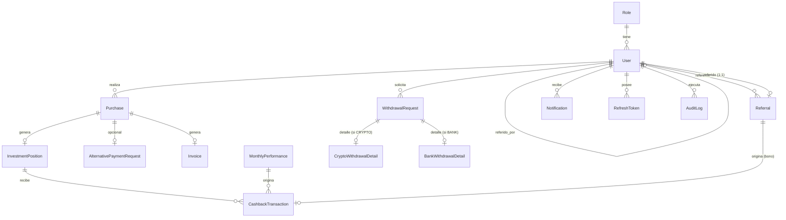

# LUXTROX ALGORITMO — Modelo de Dominio (Fase 2)

> Estado: **Diseño aprobado pendiente de confirmación final de 3 supuestos marcados como `[SUPUESTO]`**.
> Este documento define el contrato de datos y reglas de negocio que las Fases 3+ deben respetar sin reabrir discusión, salvo que se documente un cambio explícito aquí mismo.

---

## 0. Principios que rigen este modelo

1. Una **compra** (`Purchase`) siempre genera **una sola posición** (`InvestmentPosition`), sin importar cuántos paquetes contenga.
2. El **capital** de una posición es fijo desde su creación; nunca cambia.
3. El **cashback objetivo** de una posición es siempre `capital × 3.0` (300%) y tampoco cambia.
4. Todo movimiento de dinero hacia el usuario (rendimiento mensual, bono de referido) tiene **dos efectos simultáneos**:
   - Reduce el `cashback_remaining` de una posición específica (nunca el de "el usuario" en abstracto).
   - Incrementa el `available_balance` del usuario (el saldo líquido, retirable).
5. Una posición pasa a `COMPLETED` en el instante en que su `cashback_remaining` llega a 0, y a partir de ahí deja de recibir más cashback.
6. Toda operación financiera (aplicar rendimiento, pagar bono, solicitar/aprobar/rechazar retiro) **debe** generar una fila de auditoría (`AuditLog`) con quién, cuándo, qué entidad, valor anterior y valor nuevo.

---

## 1. Diagrama entidad-relación



---

## 2. Entidades

### 2.1 `Role`
Tabla separada (no enum) — decisión explícita para permitir agregar roles en el futuro sin migración de tipo.

| Campo | Tipo | Notas |
|---|---|---|
| id | UUID (PK) | |
| name | VARCHAR, UNIQUE | `ADMIN` \| `USER` (seed inicial, sin `SUPER_ADMIN`) |
| description | VARCHAR | |
| createdAt | TIMESTAMP | |

### 2.2 `User`

| Campo | Tipo | Notas |
|---|---|---|
| id | UUID (PK) | |
| fullName | VARCHAR | |
| email | VARCHAR, UNIQUE | |
| phone | VARCHAR | |
| passwordHash | VARCHAR | bcrypt/argon2 |
| roleId | FK → Role | |
| referralCode | VARCHAR, UNIQUE | autogenerado al crear el usuario |
| referredByUserId | FK → User, NULLABLE | quién lo refirió |
| status | ENUM | `ACTIVE`, `INACTIVE`, `SUSPENDED` |
| availableBalance | DECIMAL(14,2) | **saldo líquido retirable** — denormalizado, ver §4 |
| totalPackagesPurchased | INT | denormalizado, para validar el tope de 30 |
| createdAt / updatedAt | TIMESTAMP | |

> `availableBalance` es denormalizado (no calculado al vuelo) porque se lee en cada carga de dashboard y se escribe en cada transacción financiera — calcularlo sumando histórico en cada request sería costoso e innecesario. Toda escritura a este campo pasa por una transacción de BD junto con su `CashbackTransaction`/`WithdrawalRequest` correspondiente, nunca de forma aislada.

### 2.3 `Purchase`

| Campo | Tipo | Notas |
|---|---|---|
| id | UUID (PK) | |
| userId | FK → User | |
| packageQuantity | INT | 1–30 |
| totalAmount | DECIMAL(14,2) | `packageQuantity × 1100` |
| paymentMethod | ENUM | `CRYPTO`, `ALTERNATIVE` |
| status | ENUM | `PENDING`, `CONFIRMED`, `REJECTED`, `EXPIRED` |
| positionId | FK → InvestmentPosition, NULLABLE | se rellena al confirmar |
| createdAt | TIMESTAMP | |
| confirmedAt | TIMESTAMP, NULLABLE | |

**Validación al crear:** `user.totalPackagesPurchased + packageQuantity <= 30`. *(`[SUPUESTO 1]`: el tope de 30 paquetes / 33.000 USD es **acumulado por usuario a lo largo del tiempo**, no por compra individual — se infiere de que el frontend ya existente usa `maxSeminars: 30` como tope total del usuario. Confirmar.)*

### 2.4 `InvestmentPosition`

| Campo | Tipo | Notas |
|---|---|---|
| id | UUID (PK) | |
| userId | FK → User | |
| purchaseId | FK → Purchase, UNIQUE | relación 1:1 |
| capital | DECIMAL(14,2) | = `purchase.totalAmount`, inmutable |
| targetCashback | DECIMAL(14,2) | = `capital × 3.0`, inmutable |
| cashbackPaid | DECIMAL(14,2) | acumulado, empieza en 0 |
| cashbackRemaining | DECIMAL(14,2) | = `targetCashback − cashbackPaid`, denormalizado |
| status | ENUM | `ACTIVE`, `COMPLETED` |
| createdAt | TIMESTAMP | |
| completedAt | TIMESTAMP, NULLABLE | |

### 2.5 `MonthlyPerformance`

| Campo | Tipo | Notas |
|---|---|---|
| id | UUID (PK) | |
| month | INT (1–12) | |
| year | INT | |
| percentage | DECIMAL(5,2) | ej. `10.00` |
| registeredByAdminId | FK → User | |
| appliedAt | TIMESTAMP, NULLABLE | NULL = registrado pero aún no distribuido |
| createdAt | TIMESTAMP | |

UNIQUE(`month`, `year`) — un solo rendimiento por mes calendario.

### 2.6 `CashbackTransaction`
Bitácora inmutable de **cada** movimiento de cashback hacia una posición. Es la fuente de verdad para reconstruir cómo se llegó a cualquier `cashback_paid`.

| Campo | Tipo | Notas |
|---|---|---|
| id | UUID (PK) | |
| positionId | FK → InvestmentPosition | la posición que **recibe** el monto |
| type | ENUM | `MONTHLY_PERFORMANCE`, `MONTHLY_PERFORMANCE_REASSIGNED`, `REFERRAL_BONUS` |
| amount | DECIMAL(14,2) | siempre positivo |
| effectiveRate | DECIMAL(5,2), NULLABLE | ver §4.1 — solo se llena cuando hubo truncamiento |
| sourcePerformanceId | FK → MonthlyPerformance, NULLABLE | si `type` empieza con `MONTHLY_PERFORMANCE` |
| sourceReferralId | FK → Referral, NULLABLE | si `type = REFERRAL_BONUS` |
| reassignedFromPositionId | FK → InvestmentPosition, NULLABLE | si `type = MONTHLY_PERFORMANCE_REASSIGNED`, de qué posición vino el excedente |
| createdAt | TIMESTAMP | |

### 2.7 `Referral`

| Campo | Tipo | Notas |
|---|---|---|
| id | UUID (PK) | |
| referrerUserId | FK → User | quien comparte el código |
| referredUserId | FK → User, UNIQUE | quien lo usa — un registro por referido |
| referralCodeUsed | VARCHAR | snapshot del código al momento de uso |
| status | ENUM | ver máquina de estados §3.3 |
| qualifiedAt | TIMESTAMP, NULLABLE | cuándo el referido confirmó su compra |
| bonusPaidAt | TIMESTAMP, NULLABLE | |
| targetPositionId | FK → InvestmentPosition, NULLABLE | posición del **referente** que recibió el bono |

### 2.8 `WithdrawalRequest` (tabla base)

| Campo | Tipo | Notas |
|---|---|---|
| id | UUID (PK) | |
| userId | FK → User | |
| type | ENUM | `CRYPTO`, `BANK` |
| amount | DECIMAL(14,2) | ≥ 50 |
| status | ENUM | `REQUESTED`, `APPROVED`, `PAID`, `REJECTED` |
| requestedAt | TIMESTAMP | |
| processedAt | TIMESTAMP, NULLABLE | |
| paidAt | TIMESTAMP, NULLABLE | |
| processedByAdminId | FK → User, NULLABLE | |
| adminNotes | VARCHAR, NULLABLE | |

### 2.9 `CryptoWithdrawalDetail` (hija 1:1, si `type = CRYPTO`)

| Campo | Tipo |
|---|---|
| id | UUID (PK) |
| withdrawalRequestId | FK → WithdrawalRequest, UNIQUE |
| fullName, email, phone | VARCHAR |
| blockchainNetwork | VARCHAR |
| walletAddress | VARCHAR |
| transactionHash | VARCHAR, NULLABLE (se llena al pagar) |

### 2.10 `BankWithdrawalDetail` (hija 1:1, si `type = BANK`)

| Campo | Tipo |
|---|---|
| id | UUID (PK) |
| withdrawalRequestId | FK → WithdrawalRequest, UNIQUE |
| fullName, email, phone | VARCHAR |
| country, bankName | VARCHAR |
| accountType | ENUM (`SAVINGS`, `CHECKING`) |
| accountNumber, accountHolderName, documentId | VARCHAR |

### 2.11 `Invoice`

| Campo | Tipo |
|---|---|
| id | UUID (PK) |
| purchaseId | FK → Purchase, UNIQUE |
| invoiceNumber | VARCHAR, UNIQUE, secuencial |
| pdfStorageKey | VARCHAR (referencia en Cloudflare R2) |
| issuedAt | TIMESTAMP |
| sentAt | TIMESTAMP, NULLABLE (vía Resend) |

### 2.12 `AlternativePaymentRequest`

| Campo | Tipo |
|---|---|
| id | UUID (PK) |
| purchaseId | FK → Purchase, UNIQUE |
| status | ENUM: `REQUESTED`, `APPROVED`, `PAYMENT_PROOF_PENDING`, `UNDER_REVIEW`, `CONFIRMED`, `REJECTED`, `EXPIRED` |
| paymentProofStorageKey | VARCHAR, NULLABLE |
| expiresAt | TIMESTAMP (`requestedAt + 72h`) |
| reviewedByAdminId | FK → User, NULLABLE |
| reviewedAt | TIMESTAMP, NULLABLE |

### 2.13 `Notification`

| Campo | Tipo |
|---|---|
| id | UUID (PK) |
| userId | FK → User |
| type | ENUM (`CASHBACK_RECEIVED`, `REFERRAL_BONUS`, `WITHDRAWAL_STATUS_CHANGED`, `PURCHASE_CONFIRMED`, …) |
| title, message | VARCHAR |
| isRead | BOOLEAN, default false |
| createdAt | TIMESTAMP |

### 2.14 `RefreshToken`

| Campo | Tipo |
|---|---|
| id | UUID (PK) |
| userId | FK → User |
| tokenHash | VARCHAR |
| expiresAt | TIMESTAMP |
| revoked | BOOLEAN |
| createdAt | TIMESTAMP |

### 2.15 `AuditLog`

| Campo | Tipo |
|---|---|
| id | UUID (PK) |
| userId | FK → User, NULLABLE (null = acción automática del sistema) |
| entityType | VARCHAR (ej. `InvestmentPosition`) |
| entityId | UUID |
| action | VARCHAR (ej. `CASHBACK_APPLIED`, `WITHDRAWAL_REJECTED`) |
| oldValue | JSONB |
| newValue | JSONB |
| createdAt | TIMESTAMP |

---

## 3. Máquinas de estado

### 3.1 `Purchase`
```
PENDING → CONFIRMED   (pago verificado → crea InvestmentPosition + Invoice + dispara Referral check)
PENDING → REJECTED
PENDING → EXPIRED     (solo aplica a flujo ALTERNATIVE, 72h)
```

### 3.2 `InvestmentPosition`
```
ACTIVE → COMPLETED    (cashbackRemaining llega a 0; irreversible)
```

### 3.3 `Referral`
```
PENDING_PURCHASE          (referido registrado, no ha confirmado compra)
   → QUALIFIED_AWAITING_REFERRER   (referido confirmó compra, pero el referente
                                     todavía no tiene ninguna posición propia)
   → BONUS_PAID                    (referido confirmó compra Y el referente ya
                                     tenía/obtuvo una posición → bono aplicado)

QUALIFIED_AWAITING_REFERRER → BONUS_PAID
   (se dispara cuando el referente confirma SU PRIMERA compra propia)
```

*(`[SUPUESTO 2]`: si el referente ya es elegible — tiene ≥1 posición histórica — pero **todas** sus posiciones ya están `COMPLETED` (sin saldo donde aplicar los $100) al momento en que el referido califica, el bono queda en `QUALIFIED_AWAITING_REFERRER` hasta que el referente abra una nueva posición activa. Confirmar que esto es lo esperado y no, por ejemplo, pagarlo igual aunque sea a una posición ya completada.)*

### 3.4 `WithdrawalRequest`
```
REQUESTED → APPROVED → PAID
REQUESTED → REJECTED        (libera el saldo: available_balance += amount)
```
El usuario **no puede cancelar** una solicitud — solo el admin puede rechazarla (lo cual sí libera el saldo).

### 3.5 `AlternativePaymentRequest`
```
REQUESTED → APPROVED → PAYMENT_PROOF_PENDING → UNDER_REVIEW → CONFIRMED
                                                            ↘ REJECTED
REQUESTED → EXPIRED   (72h sin avanzar)
```
`CONFIRMED` dispara: crear `InvestmentPosition`, generar `Invoice`, enviar correo (Resend), evaluar `Referral`.

---

## 4. Algoritmos financieros (el corazón del motor de cashback)

### 4.1 Distribución de rendimiento mensual

Disparado al registrar un `MonthlyPerformance` (ej. Julio → 10%). Recorre **todas** las posiciones `ACTIVE` de la plataforma:

```
para cada posición ACTIVA p (orden determinístico: createdAt ASC):
    nominal = p.capital × (porcentaje / 100)

    si nominal <= p.cashbackRemaining:
        p.cashbackPaid      += nominal
        p.cashbackRemaining -= nominal
        usuario.availableBalance += nominal
        crear CashbackTransaction(p, MONTHLY_PERFORMANCE, nominal, effectiveRate=NULL)
        si p.cashbackRemaining == 0: p.status = COMPLETED

    si no (nominal > p.cashbackRemaining):              // se excede el 300%
        pagar     = p.cashbackRemaining                  // se le paga SOLO lo restante
        excedente = nominal − pagar
        p.cashbackPaid = p.targetCashback                 // queda en el tope exacto
        p.cashbackRemaining = 0
        p.status = COMPLETED
        usuario.availableBalance += pagar
        effectiveRate = (pagar / p.capital) × 100         // % real mostrado para ESTA posición
        crear CashbackTransaction(p, MONTHLY_PERFORMANCE, pagar, effectiveRate)

        // reasignar el excedente — en cascada si hace falta
        mientras excedente > 0:
            destino = posición ACTIVA más reciente del MISMO usuario,
                      con cashbackRemaining > 0, distinta de p y de
                      cualquier posición ya usada en esta cascada
            si destino no existe:
                // no hay dónde aplicarlo → el excedente NO se paga
                romper el ciclo
            si excedente <= destino.cashbackRemaining:
                destino.cashbackPaid      += excedente
                destino.cashbackRemaining -= excedente
                usuario.availableBalance  += excedente
                crear CashbackTransaction(destino, MONTHLY_PERFORMANCE_REASSIGNED,
                                           excedente, reassignedFromPositionId=p)
                si destino.cashbackRemaining == 0: destino.status = COMPLETED
                excedente = 0
            si no:
                pagar2 = destino.cashbackRemaining
                excedente -= pagar2
                destino.cashbackPaid = destino.targetCashback
                destino.cashbackRemaining = 0
                destino.status = COMPLETED
                usuario.availableBalance += pagar2
                crear CashbackTransaction(destino, MONTHLY_PERFORMANCE_REASSIGNED,
                                           pagar2, reassignedFromPositionId=p)
                // el ciclo continúa buscando otra posición para lo que sobra

    crear AuditLog(entidad=InvestmentPosition, acción=CASHBACK_APPLIED, ...)

marcar MonthlyPerformance.appliedAt = ahora
```

> **Regla clave confirmada:** nunca se paga de más. El usuario jamás recibe más del 300% de su capital total invertido; cualquier excedente que no tenga dónde reasignarse simplemente no se paga (no se acumula para el futuro, no se devuelve a la empresa de otra forma — se pierde para el cálculo de ese mes).

### 4.2 Bono de referido ($100 fijo)

Condiciones (**ambas** deben cumplirse, sin importar el orden en que ocurran):
- El **referente** tiene al menos una posición (`ACTIVE` o `COMPLETED`) histórica.
- El **referido** completó y confirmó totalmente su propia compra.

```
función evaluarReferral(referral):
    si referral.referido NO confirmó compra todavía: salir   // nada que hacer aún
    referral.qualifiedAt = ahora (si no estaba ya seteado)

    si referente NO tiene ninguna posición (activa o completada):
        referral.status = QUALIFIED_AWAITING_REFERRER
        salir

    pagarBono(referral)

función pagarBono(referral):
    destino = posición ACTIVA más reciente del referente con cashbackRemaining > 0
    si destino no existe:
        referral.status = QUALIFIED_AWAITING_REFERRER   // ver [SUPUESTO 2]
        salir

    monto = min(100, destino.cashbackRemaining)
    destino.cashbackPaid      += monto
    destino.cashbackRemaining -= monto
    referente.availableBalance += monto
    si destino.cashbackRemaining == 0: destino.status = COMPLETED

    referral.status      = BONUS_PAID
    referral.bonusPaidAt = ahora
    referral.targetPositionId = destino.id
    crear CashbackTransaction(destino, REFERRAL_BONUS, monto, sourceReferralId=referral)
    crear AuditLog(...)
```

**Disparadores de `evaluarReferral`:**
1. Cuando la compra del **referido** pasa a `CONFIRMED`.
2. Cuando la compra del **referente** pasa a `CONFIRMED` (por si él calificó después que su referido) → en este caso se evalúan **todos** los `Referral` en estado `QUALIFIED_AWAITING_REFERRER` donde `referrerUserId` = este usuario.

### 4.3 Retiro

```
solicitar(usuario, monto, tipo, detalle):
    validar monto >= 50
    validar monto <= usuario.availableBalance
    usuario.availableBalance -= monto                 // descuento inmediato
    crear WithdrawalRequest(status=REQUESTED)
    crear CryptoWithdrawalDetail o BankWithdrawalDetail
    crear AuditLog

aprobar(solicitud, admin):
    solicitud.status = APPROVED
    crear AuditLog

rechazar(solicitud, admin, motivo):
    solicitud.status = REJECTED
    usuario.availableBalance += solicitud.amount       // se devuelve el saldo
    crear AuditLog

marcarPagado(solicitud, admin, txHash?):
    solicitud.status = PAID
    solicitud.paidAt = ahora
    crear AuditLog
```

---

## 5. Supuestos pendientes de confirmación

| # | Supuesto | Impacto si está mal |
|---|---|---|
| 1 | El tope de 30 paquetes / 33.000 USD es **acumulado por usuario**, no por compra individual | Cambiaría la validación en `Purchase.create()` |
| 2 | Si el referente es elegible pero todas sus posiciones están `COMPLETED`, el bono queda en espera hasta que abra una nueva posición (no se paga "perdido" ni se aplica a una posición ya completada) | Cambiaría la lógica de `pagarBono()` |
| 3 | El orden de "posición más reciente" para reasignar excedentes/bonos es por `createdAt DESC` (la posición más nueva primero) | Cambiaría qué posición específica recibe cada pago — afecta auditoría pero no el monto total |

Si alguno de estos tres no es correcto, se ajusta este documento antes de tocar código de Fase 4 en adelante (no rompe nada de lo ya construido, ya que aún no hay implementación).

---

## 6. Notas de implementación para fases futuras

- Todas las cantidades monetarias: `DECIMAL(14,2)`, nunca `FLOAT`/`DOUBLE` (precisión financiera).
- Todo lo descrito en §4 corre dentro de una **transacción de base de datos** por posición afectada (o por todo el lote del `MonthlyPerformance`, evaluar en Fase 6 si se hace todo en una sola transacción grande o por posición con compensación en caso de fallo parcial).
- `CashbackTransaction` es **inmutable** — nunca se actualiza ni se borra una fila ya creada, solo se insertan nuevas filas. Es la fuente de verdad auditable.
- El job que aplica `MonthlyPerformance` debe ser **idempotente**: si se corre dos veces por error, no debe duplicar pagos (verificar `appliedAt IS NULL` antes de ejecutar, y marcarlo dentro de la misma transacción).
