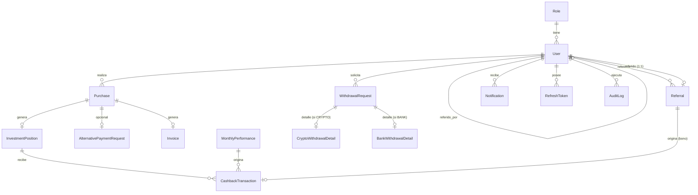

# LUXTROX ALGORITMO — Modelo de Dominio (Fase 2)

> Estado: **Diseño aprobado pendiente de confirmación final de 3 supuestos marcados como `[SUPUESTO]`**.
> Este documento define el contrato de datos y reglas de negocio que las Fases 3+ deben respetar sin reabrir discusión, salvo que se documente un cambio explícito aquí mismo.

---

## 0. Principios que rigen este modelo

1. Una **compra** (`Purchase`) siempre genera **una sola posición** (`InvestmentPosition`), sin importar cuántos paquetes contenga.
2. El **capital** de una posición es fijo desde su creación; nunca cambia.
3. El **cashback objetivo** de una posición es siempre `capital × 3.0` (300%) y tampoco cambia.
4. Todo movimiento de dinero hacia el usuario (rendimiento mensual, bono de referido) tiene **dos efectos simultáneos**:
   - Reduce el `cashback_remaining` de una posición específica (nunca el de "el usuario" en abstracto).
   - Incrementa el `available_balance` del usuario (el saldo líquido, retirable).
5. Una posición pasa a `COMPLETED` en el instante en que su `cashback_remaining` llega a 0, y a partir de ahí deja de recibir más cashback.
6. Toda operación financiera (aplicar rendimiento, pagar bono, solicitar/aprobar/rechazar retiro) **debe** generar una fila de auditoría (`AuditLog`) con quién, cuándo, qué entidad, valor anterior y valor nuevo.

---

## 1. Diagrama entidad-relación



---

## 2. Entidades

### 2.1 `Role`
Tabla separada (no enum) — decisión explícita para permitir agregar roles en el futuro sin migración de tipo.

| Campo | Tipo | Notas |
|---|---|---|
| id | UUID (PK) | |
| name | VARCHAR, UNIQUE | `ADMIN` \| `USER` (seed inicial, sin `SUPER_ADMIN`) |
| description | VARCHAR | |
| createdAt | TIMESTAMP | |

### 2.2 `User`

| Campo | Tipo | Notas |
|---|---|---|
| id | UUID (PK) | |
| fullName | VARCHAR | |
| email | VARCHAR, UNIQUE | |
| phone | VARCHAR | |
| passwordHash | VARCHAR | bcrypt/argon2 |
| roleId | FK → Role | |
| referralCode | VARCHAR, UNIQUE | autogenerado al crear el usuario |
| referredByUserId | FK → User, NULLABLE | quién lo refirió |
| status | ENUM | `ACTIVE`, `INACTIVE`, `SUSPENDED` |
| availableBalance | DECIMAL(14,2) | **saldo líquido retirable** — denormalizado, ver §4 |
| totalPackagesPurchased | INT | denormalizado, para validar el tope de 30 |
| createdAt / updatedAt | TIMESTAMP | |

> `availableBalance` es denormalizado (no calculado al vuelo) porque se lee en cada carga de dashboard y se escribe en cada transacción financiera — calcularlo sumando histórico en cada request sería costoso e innecesario. Toda escritura a este campo pasa por una transacción de BD junto con su `CashbackTransaction`/`WithdrawalRequest` correspondiente, nunca de forma aislada.

### 2.3 `Purchase`

| Campo | Tipo | Notas |
|---|---|---|
| id | UUID (PK) | |
| userId | FK → User | |
| planType | ENUM | `DRIVER`, `ZENITH` — agregado en §7.1 |
| packageQuantity | INT | 1–30, **solo aplica a DRIVER** (Zenith siempre es 1) |
| totalAmount | DECIMAL(14,2) | Driver: `packageQuantity × 1099`. Zenith: `2299` fijo (ver §7.1, precio de Driver corregido de 1100 a 1099) |
| paymentMethod | ENUM | `CRYPTO`, `ALTERNATIVE` |
| status | ENUM | `PENDING`, `CONFIRMED`, `REJECTED`, `EXPIRED` |
| positionId | FK → InvestmentPosition, NULLABLE | se rellena al confirmar — **solo si planType = DRIVER**; Zenith nunca tiene posición |
| createdAt | TIMESTAMP | |
| confirmedAt | TIMESTAMP, NULLABLE | |

**Validación al crear (solo DRIVER):** `user.totalPackagesPurchased + packageQuantity <= 30`. *(`[SUPUESTO 1]`: el tope de 30 paquetes / 33.000 USD es **acumulado por usuario a lo largo del tiempo**, no por compra individual — confirmado por el cliente. No aplica a Zenith.)*

### 2.4 `InvestmentPosition`

| Campo | Tipo | Notas |
|---|---|---|
| id | UUID (PK) | |
| userId | FK → User | |
| purchaseId | FK → Purchase, UNIQUE | relación 1:1 |
| capital | DECIMAL(14,2) | = `purchase.totalAmount`, inmutable |
| targetCashback | DECIMAL(14,2) | = `capital × 3.0`, inmutable |
| cashbackPaid | DECIMAL(14,2) | acumulado, empieza en 0 |
| cashbackRemaining | DECIMAL(14,2) | = `targetCashback − cashbackPaid`, denormalizado |
| status | ENUM | `ACTIVE`, `COMPLETED` |
| createdAt | TIMESTAMP | |
| completedAt | TIMESTAMP, NULLABLE | |

### 2.5 `MonthlyPerformance`

| Campo | Tipo | Notas |
|---|---|---|
| id | UUID (PK) | |
| month | INT (1–12) | |
| year | INT | |
| percentage | DECIMAL(5,2) | ej. `10.00` |
| registeredByAdminId | FK → User | |
| appliedAt | TIMESTAMP, NULLABLE | NULL = registrado pero aún no distribuido |
| createdAt | TIMESTAMP | |

UNIQUE(`month`, `year`) — un solo rendimiento por mes calendario.

### 2.6 `CashbackTransaction`
Bitácora inmutable de **cada** movimiento de cashback hacia una posición. Es la fuente de verdad para reconstruir cómo se llegó a cualquier `cashback_paid`.

| Campo | Tipo | Notas |
|---|---|---|
| id | UUID (PK) | |
| positionId | FK → InvestmentPosition, **NULLABLE desde §7.3** | la posición que **recibe** el monto — NULL si `type = REFERRAL_BONUS_DIRECT` |
| type | ENUM | `MONTHLY_PERFORMANCE`, `MONTHLY_PERFORMANCE_REASSIGNED`, `REFERRAL_BONUS`, `REFERRAL_BONUS_DIRECT` (agregado en §7.2 — comisión pagada directo a `available_balance`, sin posición asociada) |
| amount | DECIMAL(14,2) | siempre positivo |
| effectiveRate | DECIMAL(5,2), NULLABLE | ver §4.1 — solo se llena cuando hubo truncamiento |
| sourcePerformanceId | FK → MonthlyPerformance, NULLABLE | si `type` empieza con `MONTHLY_PERFORMANCE` |
| sourceReferralId | FK → Referral, NULLABLE | si `type = REFERRAL_BONUS` |
| reassignedFromPositionId | FK → InvestmentPosition, NULLABLE | si `type = MONTHLY_PERFORMANCE_REASSIGNED`, de qué posición vino el excedente |
| createdAt | TIMESTAMP | |

### 2.7 `Referral`

| Campo | Tipo | Notas |
|---|---|---|
| id | UUID (PK) | |
| referrerUserId | FK → User | quien comparte el código |
| referredUserId | FK → User, UNIQUE | quien lo usa — un registro por referido |
| referralCodeUsed | VARCHAR | snapshot del código al momento de uso |
| status | ENUM | ver máquina de estados §3.3 |
| qualifiedAt | TIMESTAMP, NULLABLE | cuándo el referido confirmó su compra |
| bonusPaidAt | TIMESTAMP, NULLABLE | |
| targetPositionId | FK → InvestmentPosition, NULLABLE | posición del **referente** que recibió el bono |

### 2.8 `WithdrawalRequest` (tabla base)

| Campo | Tipo | Notas |
|---|---|---|
| id | UUID (PK) | |
| userId | FK → User | |
| type | ENUM | `CRYPTO`, `BANK` |
| amount | DECIMAL(14,2) | ≥ 50 |
| status | ENUM | `REQUESTED`, `APPROVED`, `PAID`, `REJECTED` |
| requestedAt | TIMESTAMP | |
| processedAt | TIMESTAMP, NULLABLE | |
| paidAt | TIMESTAMP, NULLABLE | |
| processedByAdminId | FK → User, NULLABLE | |
| adminNotes | VARCHAR, NULLABLE | |

### 2.9 `CryptoWithdrawalDetail` (hija 1:1, si `type = CRYPTO`)

| Campo | Tipo |
|---|---|
| id | UUID (PK) |
| withdrawalRequestId | FK → WithdrawalRequest, UNIQUE |
| fullName, email, phone | VARCHAR |
| blockchainNetwork | VARCHAR |
| walletAddress | VARCHAR |
| transactionHash | VARCHAR, NULLABLE (se llena al pagar) |

### 2.10 `BankWithdrawalDetail` (hija 1:1, si `type = BANK`)

| Campo | Tipo |
|---|---|
| id | UUID (PK) |
| withdrawalRequestId | FK → WithdrawalRequest, UNIQUE |
| fullName, email, phone | VARCHAR |
| country, bankName | VARCHAR |
| accountType | ENUM (`SAVINGS`, `CHECKING`) |
| accountNumber, accountHolderName, documentId | VARCHAR |

### 2.11 `Invoice`

| Campo | Tipo |
|---|---|
| id | UUID (PK) |
| purchaseId | FK → Purchase, UNIQUE |
| invoiceNumber | VARCHAR, UNIQUE, secuencial |
| pdfStorageKey | VARCHAR (referencia en Supabase Storage, S3-compatible -- ver adenda §8, Fase 7) |
| issuedAt | TIMESTAMP |
| sentAt | TIMESTAMP, NULLABLE (vía Resend) |

### 2.12 `AlternativePaymentRequest`

| Campo | Tipo |
|---|---|
| id | UUID (PK) |
| purchaseId | FK → Purchase, UNIQUE |
| status | ENUM: `REQUESTED`, `APPROVED`, `PAYMENT_PROOF_PENDING`, `UNDER_REVIEW`, `CONFIRMED`, `REJECTED`, `EXPIRED` |
| paymentProofStorageKey | VARCHAR, NULLABLE |
| expiresAt | TIMESTAMP (`requestedAt + 72h`) |
| reviewedByAdminId | FK → User, NULLABLE |
| reviewedAt | TIMESTAMP, NULLABLE |

### 2.13 `Notification`

| Campo | Tipo |
|---|---|
| id | UUID (PK) |
| userId | FK → User |
| type | ENUM (`CASHBACK_RECEIVED`, `REFERRAL_BONUS`, `WITHDRAWAL_STATUS_CHANGED`, `PURCHASE_CONFIRMED`, …) |
| title, message | VARCHAR |
| isRead | BOOLEAN, default false |
| createdAt | TIMESTAMP |

### 2.14 `RefreshToken`

| Campo | Tipo |
|---|---|
| id | UUID (PK) |
| userId | FK → User |
| tokenHash | VARCHAR |
| expiresAt | TIMESTAMP |
| revoked | BOOLEAN |
| createdAt | TIMESTAMP |

### 2.15 `AuditLog`

| Campo | Tipo |
|---|---|
| id | UUID (PK) |
| userId | FK → User, NULLABLE (null = acción automática del sistema) |
| entityType | VARCHAR (ej. `InvestmentPosition`) |
| entityId | UUID |
| action | VARCHAR (ej. `CASHBACK_APPLIED`, `WITHDRAWAL_REJECTED`) |
| oldValue | JSONB |
| newValue | JSONB |
| createdAt | TIMESTAMP |

---

## 3. Máquinas de estado

### 3.1 `Purchase`
```
PENDING → CONFIRMED   (pago verificado → crea InvestmentPosition + Invoice + dispara Referral check)
PENDING → REJECTED
PENDING → EXPIRED     (solo aplica a flujo ALTERNATIVE, 72h)
```

### 3.2 `InvestmentPosition`
```
ACTIVE → COMPLETED    (cashbackRemaining llega a 0; irreversible)
```

### 3.3 `Referral`
```
PENDING_PURCHASE          (referido registrado, no ha confirmado compra)
   → QUALIFIED_AWAITING_REFERRER   (referido confirmó compra, pero el referente
                                     todavía no tiene ninguna posición propia)
   → BONUS_PAID                    (referido confirmó compra Y el referente ya
                                     tenía/obtuvo una posición → bono aplicado)

QUALIFIED_AWAITING_REFERRER → BONUS_PAID
   (se dispara cuando el referente confirma SU PRIMERA compra propia)
```

*(`[SUPUESTO 2]`: si el referente ya es elegible — tiene ≥1 posición histórica — pero **todas** sus posiciones ya están `COMPLETED` (sin saldo donde aplicar los $100) al momento en que el referido califica, el bono queda en `QUALIFIED_AWAITING_REFERRER` hasta que el referente abra una nueva posición activa. Confirmar que esto es lo esperado y no, por ejemplo, pagarlo igual aunque sea a una posición ya completada.)*

### 3.4 `WithdrawalRequest`
```
REQUESTED → APPROVED → PAID
REQUESTED → REJECTED        (libera el saldo: available_balance += amount)
```
El usuario **no puede cancelar** una solicitud — solo el admin puede rechazarla (lo cual sí libera el saldo).

### 3.5 `AlternativePaymentRequest`
```
REQUESTED → APPROVED → PAYMENT_PROOF_PENDING → UNDER_REVIEW → CONFIRMED
                                                            ↘ REJECTED
REQUESTED → EXPIRED   (72h sin avanzar)
```
`CONFIRMED` dispara: crear `InvestmentPosition`, generar `Invoice`, enviar correo (Resend), evaluar `Referral`.

---

## 4. Algoritmos financieros (el corazón del motor de cashback)

### 4.1 Distribución de rendimiento mensual

Disparado al registrar un `MonthlyPerformance` (ej. Julio → 10%). Recorre **todas** las posiciones `ACTIVE` de la plataforma:

```
para cada posición ACTIVA p (orden determinístico: createdAt ASC):
    nominal = p.capital × (porcentaje / 100)

    si nominal <= p.cashbackRemaining:
        p.cashbackPaid      += nominal
        p.cashbackRemaining -= nominal
        usuario.availableBalance += nominal
        crear CashbackTransaction(p, MONTHLY_PERFORMANCE, nominal, effectiveRate=NULL)
        si p.cashbackRemaining == 0: p.status = COMPLETED

    si no (nominal > p.cashbackRemaining):              // se excede el 300%
        pagar     = p.cashbackRemaining                  // se le paga SOLO lo restante
        excedente = nominal − pagar
        p.cashbackPaid = p.targetCashback                 // queda en el tope exacto
        p.cashbackRemaining = 0
        p.status = COMPLETED
        usuario.availableBalance += pagar
        effectiveRate = (pagar / p.capital) × 100         // % real mostrado para ESTA posición
        crear CashbackTransaction(p, MONTHLY_PERFORMANCE, pagar, effectiveRate)

        // reasignar el excedente — en cascada si hace falta
        mientras excedente > 0:
            destino = posición ACTIVA más reciente del MISMO usuario,
                      con cashbackRemaining > 0, distinta de p y de
                      cualquier posición ya usada en esta cascada
            si destino no existe:
                // no hay dónde aplicarlo → el excedente NO se paga
                romper el ciclo
            si excedente <= destino.cashbackRemaining:
                destino.cashbackPaid      += excedente
                destino.cashbackRemaining -= excedente
                usuario.availableBalance  += excedente
                crear CashbackTransaction(destino, MONTHLY_PERFORMANCE_REASSIGNED,
                                           excedente, reassignedFromPositionId=p)
                si destino.cashbackRemaining == 0: destino.status = COMPLETED
                excedente = 0
            si no:
                pagar2 = destino.cashbackRemaining
                excedente -= pagar2
                destino.cashbackPaid = destino.targetCashback
                destino.cashbackRemaining = 0
                destino.status = COMPLETED
                usuario.availableBalance += pagar2
                crear CashbackTransaction(destino, MONTHLY_PERFORMANCE_REASSIGNED,
                                           pagar2, reassignedFromPositionId=p)
                // el ciclo continúa buscando otra posición para lo que sobra

    crear AuditLog(entidad=InvestmentPosition, acción=CASHBACK_APPLIED, ...)

marcar MonthlyPerformance.appliedAt = ahora
```

> **Regla clave confirmada:** nunca se paga de más. El usuario jamás recibe más del 300% de su capital total invertido; cualquier excedente que no tenga dónde reasignarse simplemente no se paga (no se acumula para el futuro, no se devuelve a la empresa de otra forma — se pierde para el cálculo de ese mes).

### 4.2 Bono de referido ($100 fijo)

Condiciones (**ambas** deben cumplirse, sin importar el orden en que ocurran):
- El **referente** tiene al menos una posición (`ACTIVE` o `COMPLETED`) histórica.
- El **referido** completó y confirmó totalmente su propia compra.

```
función evaluarReferral(referral):
    si referral.referido NO confirmó compra todavía: salir   // nada que hacer aún
    referral.qualifiedAt = ahora (si no estaba ya seteado)

    si referente NO tiene ninguna posición (activa o completada):
        referral.status = QUALIFIED_AWAITING_REFERRER
        salir

    pagarBono(referral)

función pagarBono(referral):
    destino = posición ACTIVA más reciente del referente con cashbackRemaining > 0
    si destino no existe:
        referral.status = QUALIFIED_AWAITING_REFERRER   // ver [SUPUESTO 2]
        salir

    monto = min(100, destino.cashbackRemaining)
    destino.cashbackPaid      += monto
    destino.cashbackRemaining -= monto
    referente.availableBalance += monto
    si destino.cashbackRemaining == 0: destino.status = COMPLETED

    referral.status      = BONUS_PAID
    referral.bonusPaidAt = ahora
    referral.targetPositionId = destino.id
    crear CashbackTransaction(destino, REFERRAL_BONUS, monto, sourceReferralId=referral)
    crear AuditLog(...)
```

**Disparadores de `evaluarReferral`:**
1. Cuando la compra del **referido** pasa a `CONFIRMED`.
2. Cuando la compra del **referente** pasa a `CONFIRMED` (por si él calificó después que su referido) → en este caso se evalúan **todos** los `Referral` en estado `QUALIFIED_AWAITING_REFERRER` donde `referrerUserId` = este usuario.

### 4.3 Retiro

```
solicitar(usuario, monto, tipo, detalle):
    validar monto >= 50
    validar monto <= usuario.availableBalance
    usuario.availableBalance -= monto                 // descuento inmediato
    crear WithdrawalRequest(status=REQUESTED)
    crear CryptoWithdrawalDetail o BankWithdrawalDetail
    crear AuditLog

aprobar(solicitud, admin):
    solicitud.status = APPROVED
    crear AuditLog

rechazar(solicitud, admin, motivo):
    solicitud.status = REJECTED
    usuario.availableBalance += solicitud.amount       // se devuelve el saldo
    crear AuditLog

marcarPagado(solicitud, admin, txHash?):
    solicitud.status = PAID
    solicitud.paidAt = ahora
    crear AuditLog
```

---

## 5. Supuestos — historial de confirmación

| # | Supuesto | Estado |
|---|---|---|
| 1 | El tope de 30 paquetes / 33.000 USD es **acumulado por usuario**, no por compra individual | ✅ Confirmado por el cliente (solo aplica a Driver, ver §7.1) |
| 2 | ~~Si el referente es elegible pero todas sus posiciones están `COMPLETED`, el bono queda en espera hasta que abra una nueva posición~~ | ✅ Confirmado inicialmente, luego **reemplazado en §7.2**: ahora se paga directo a `available_balance` en ese caso |
| 3 | El orden de "posición más reciente" para reasignar excedentes/bonos es por `createdAt DESC` (la posición más nueva primero) | ✅ Confirmado por el cliente |

Los 3 quedaron resueltos antes de escribir código de Fase 6. El #2 cambió de
respuesta una vez se introdujo Zenith (ver §7) — el documento ya refleja la
versión final, no la original.

---

## 6. Notas de implementación para fases futuras

- Todas las cantidades monetarias: `DECIMAL(14,2)`, nunca `FLOAT`/`DOUBLE` (precisión financiera).
- Todo lo descrito en §4 corre dentro de una **transacción de base de datos** por posición afectada (o por todo el lote del `MonthlyPerformance`, evaluar en Fase 6 si se hace todo en una sola transacción grande o por posición con compensación en caso de fallo parcial).
- `CashbackTransaction` es **inmutable** — nunca se actualiza ni se borra una fila ya creada, solo se insertan nuevas filas. Es la fuente de verdad auditable.
- El job que aplica `MonthlyPerformance` debe ser **idempotente**: si se corre dos veces por error, no debe duplicar pagos (verificar `appliedAt IS NULL` antes de ejecutar, y marcarlo dentro de la misma transacción).

---

## 7. Adenda — Fase 6: separación Driver / Zenith (reemplaza partes de §4.2 y §5)

> Este apartado documenta un cambio de negocio real ocurrido durante la Fase 6,
> después de que el resto del documento ya estaba aprobado. Donde contradiga
> algo de las secciones 1–6, **esta adenda manda**.

### 7.1 Dos productos, no uno

El negocio ya no vende "un único servicio" — vende dos productos independientes:

| | Luxtrox Driver | Luxtrox Zenith |
|---|---|---|
| Precio | $1,099 USD (antes $1,100) | $2,299 USD |
| Qué es | Lo que ya existía: el equipo opera el capital del usuario | Se vende e instala un bot de trading; el usuario opera por su cuenta |
| ¿Crea `InvestmentPosition`? | Sí, igual que siempre (`target_cashback = capital × 3`) | **No** — Zenith no participa del motor de cashback en absoluto |
| ¿Recibe rendimiento mensual? | Sí | No |
| Recurrencia | Ninguna (pago único, hasta 30 paquetes acumulados) | Renovación anual obligatoria de $250 para mantener el bot activo |
| Tope de 30 paquetes (§2.3) | Aplica, sin cambios | No aplica — Zenith es cantidad fija de 1 por compra, no cuenta para `total_packages_purchased` |

### 7.2 Comisión de referido — reemplaza completamente el bono fijo de $100 (§4.2 original)

La comisión ya no es un monto fijo. Depende de qué compró el **referido**:

- Venta de Driver referida → el **referente** gana **9%** del precio = `1099 × 0.09` = **$98.91**
- Venta de Zenith referida → el **referente** gana **40%** del precio = `2299 × 0.40` = **$919.60**

**Elegibilidad para ganar comisiones (reemplaza la condición original "posición activa o completada"):**
El referente es elegible con **cualquier compra confirmada**, Driver o Zenith — no es necesario haber comprado Driver específicamente.

**Dónde aterriza la comisión (reemplaza por completo el `QUALIFIED_AWAITING_REFERRER` por falta de posición):**

```
monto = comisión calculada según el plan que compró el referido

destino = posición ACTIVA más reciente del referente con cashbackRemaining > 0
          (busca solo entre posiciones DRIVER -- Zenith nunca es destino,
           no tiene cashback_remaining)

si destino existe:
    aplicar = min(monto, destino.cashbackRemaining)
    destino.cashbackPaid      += aplicar
    destino.cashbackRemaining -= aplicar
    si destino.cashbackRemaining == 0: destino.status = COMPLETED
    sobra = monto - aplicar
si destino no existe (el referente solo tiene Zenith, o todas sus
                       posiciones Driver ya estan COMPLETED):
    sobra = monto   // nada que aplicar a ninguna posicion

referente.availableBalance += monto   // SIEMPRE el monto completo,
                                       // haya o no posicion de por medio

si sobra > 0:
    crear CashbackTransaction sin position_id asociado, tipo
    REFERRAL_BONUS_DIRECT, registrando que esa parte (o el monto
    completo) fue directo a available_balance sin pasar por ninguna
    posicion -- mantiene la auditoria completa aunque no haya
    "adelanto de cashback" de por medio.
```

> **Esto ya NO es lo mismo que el algoritmo 4.1** (rendimiento mensual): ahí, el
> excedente que no cabe en ninguna posición se pierde (no se paga). Aquí, el
> referente **sí** recibe el dinero completo siempre — solo cambia si ese dinero
> se contabiliza también como "avance de cashback" de una posición Driver o no.
> Es una decisión de negocio explícita confirmada por el cliente, no una
> inconsistencia.

`Referral.status = QUALIFIED_AWAITING_REFERRER` **sigue existiendo**, pero ahora
significa algo más estrecho que en el diseño original: ya no se alcanza por
"el referente tiene posiciones pero todas están completas" (eso ahora se paga
directo a `available_balance`, ver arriba) — se alcanza **solo** cuando el
referente **todavía no tiene ninguna compra confirmada de ningún tipo**
(ni Driver ni Zenith). En ese caso sí hay que esperar: cuando el referente
confirme su primera compra (la que sea), se re-evalúan sus referidos pendientes
y se paga lo que corresponda.

`[SUPUESTO 4 — NO confirmado explícitamente por el cliente, decisión tomada al
implementar]`: el bono de referido es **un evento único por relación de
referido**, no por compra. Si la misma persona referida hace una segunda
compra más adelante (ej. compra Driver y luego también Zenith), el referente
**no** cobra una segunda comisión — solo la primera compra confirmada de ese
referido dispara el pago. Si esto no es lo que se quiere (por ejemplo, si cada
compra del referido —Driver y Zenith— debería pagar su propia comisión por
separado), avisar para ajustar `ReferralService.onReferredPurchaseConfirmed()`.

### 7.3 Cambios de esquema (Flyway V16, no se modifican migraciones ya aplicadas)

```sql
ALTER TABLE purchases ADD COLUMN plan_type VARCHAR(10) NOT NULL DEFAULT 'DRIVER'
    CHECK (plan_type IN ('DRIVER', 'ZENITH'));

CREATE TABLE zenith_licenses (
    id                   UUID PRIMARY KEY,
    user_id              UUID NOT NULL REFERENCES users(id),
    purchase_id          UUID NOT NULL UNIQUE REFERENCES purchases(id),
    status               VARCHAR(20) NOT NULL DEFAULT 'ACTIVE' CHECK (status IN ('ACTIVE','EXPIRED')),
    activated_at         TIMESTAMPTZ NOT NULL,
    current_period_end   TIMESTAMPTZ NOT NULL,
    created_at           TIMESTAMPTZ NOT NULL DEFAULT now()
);

CREATE TABLE zenith_renewal_payments (
    id           UUID PRIMARY KEY,
    license_id   UUID NOT NULL REFERENCES zenith_licenses(id),
    amount       DECIMAL(14,2) NOT NULL CHECK (amount = 250.00),
    period_start TIMESTAMPTZ NOT NULL,
    period_end   TIMESTAMPTZ NOT NULL,
    paid_at      TIMESTAMPTZ NOT NULL DEFAULT now()
);
```

`cashback_transactions.position_id` debe pasar a ser **NULLABLE** (ya no es
`NOT NULL`) para soportar el nuevo tipo `REFERRAL_BONUS_DIRECT`, que no
referencia ninguna posición.

## 8. Adenda — Fase 7: Integraciones externas

### 8.1 Verificación de pago CRYPTO — NOWPayments (reemplaza la idea original de revisión manual)

Las compras `paymentMethod = CRYPTO` se confirman automáticamente, no a mano:

1. Al crear la compra, el backend pide un *invoice* a NOWPayments y devuelve
   `cryptoInvoiceUrl` — el frontend redirige ahí al usuario para pagar.
2. NOWPayments notifica el resultado vía un callback IPN a
   `POST /webhooks/nowpayments/ipn`, firmado con HMAC-SHA512 sobre el JSON
   del callback **con sus claves ordenadas recursivamente** (no solo el
   primer nivel) antes de firmar — si la firma no es válida, se rechaza sin
   procesar nada.
3. Solo el estado `payment_status = "finished"` (liquidación final, no
   `"confirmed"`, que es un paso intermedio) dispara
   `PurchaseService.confirmPurchase()`.

`purchases.nowpayments_invoice_id` (V17) guarda la referencia del invoice
para trazabilidad/soporte.

### 8.2 Almacenamiento de archivos — Supabase Storage (reemplaza Cloudflare R2)

Cambio de proveedor decidido por el cliente durante esta fase: en vez de
Cloudflare R2 (la idea original), se usa **Supabase Storage** en modo
S3-compatible, ya que el proyecto ya tiene cuenta de Supabase y evita
gestionar credenciales de un proveedor más. Usado para:
- PDFs de factura (`invoices.pdf_storage_key`)
- Comprobantes de pago alternativo (`alternative_payment_requests.payment_proof_storage_key`) —
  ver supuesto pendiente abajo.

### 8.3 Correos — Resend

Eventos que disparan un correo (todos con manejo de fallos aislado: si Resend
falla, la operación de negocio que lo disparó **no se revierte**, solo se
registra en `audit_logs` para investigar después):

| Evento | Disparado desde |
|---|---|
| Bienvenida al registrarse | `AuthService.register()` |
| Compra confirmada (con factura PDF adjunta) | `PurchaseService.confirmPurchase()` |
| Cambio de estado de retiro (aprobado/rechazado/pagado) | `WithdrawalService` |
| Comisión de referido recibida | `ReferralService.payBonus()` |

### 8.4 Pendiente — NO se construyó en esta fase

`AlternativePaymentRequest` (el flujo de pago manual con comprobante +
revisión de admin, diseñado desde la Fase 2) **sigue sin tener un service ni
controller propios**. Esta fase se enfocó en lo que el cliente pidió
explícitamente (NOWPayments, Resend, Storage) — el flujo `ALTERNATIVE`
todavía no tiene forma de pasar de `PENDING` a `CONFIRMED` en la práctica.
Si se va a usar ese método de pago, hace falta una fase de seguimiento para
construirlo (reutilizando `SupabaseStorageClient` para subir el comprobante).

## 9. Adenda — Fase 8: corrección de fondo en la elegibilidad de comisiones de referido

**Esto reemplaza por completo §7.2 y la adenda de la Fase 6.** El diseño
original pagaba la comisión completa a cualquier referente con *al menos una
compra confirmada de cualquier tipo* (Driver o Zenith), con un mecanismo de
espera/reintento si todavía no calificaba. El cliente aclaró que esa regla
estaba mal — la real es:

### 9.1 Comisión por venta de Driver

Solo se paga si el referente **tiene una posición Driver propia ACTIVA**
(con cashback pendiente) **en el momento exacto** en que se confirma la
compra del referido:

- Se aplica como avance a esa posición (`cashback_paid`/`cashback_remaining`),
  tope = lo que le quede pendiente al referente.
- Lo que exceda ese tope **se pierde** — a propósito. No se reasigna a otra
  posición del referente, ni se paga directo a `available_balance` (a
  diferencia del rendimiento mensual, que sí cascada entre posiciones).
- Si el referente no tiene **ninguna** posición Driver activa (nunca compró
  Driver, o ya completó el cashback de todas sus posiciones), **toda** la
  comisión se pierde.

### 9.2 Comisión por venta de Zenith

Solo se paga si el referente tiene una **licencia Zenith propia con status
ACTIVE** (no `EXPIRED`) en el momento exacto de la confirmación. Si califica,
se paga **completa y directa** a `available_balance` — Zenith no tiene
cashback, así que aquí no hay tope ni reparto, es una verificación binaria.
Si no califica, toda la comisión se pierde.

### 9.3 Sin reintentos — evaluación única

La comisión se evalúa **una sola vez**, en el instante en que se confirma la
compra del referido. Si el referente no califica en ese momento exacto, la
comisión se pierde **para siempre** — aunque compre el plan que le faltaba
cinco minutos después. Por esto, el disparador `onReferrerPurchaseConfirmed`
(que re-evaluaba referrals pendientes cuando el referente finalmente
calificaba) **se eliminó por completo**, junto con el estado
`QUALIFIED_AWAITING_REFERRER` (que queda en el `CHECK` de la base solo por
compatibilidad con filas históricas — el código nuevo nunca vuelve a
escribirlo). El nuevo estado terminal es `RESOLVED`: significa "ya se evaluó
esta compra", sin indicar por sí solo si se pagó, se pagó parcial, o se
perdió — eso vive en `cashback_transactions` (lo que sí se pagó) y
`audit_logs` (acción `REFERRAL_COMMISSION_FORFEITED_*`, lo que se perdió y
por qué).

### 9.4 Cada compra del referido se evalúa de forma independiente

Si la misma persona referida compra **ambos** planes (Driver y Zenith, en
cualquier orden), cada venta dispara su propia evaluación contra el plan
correspondiente del referente. Esto significa que, si el referente es
propietario de ambos planes, puede cobrar **ambas** comisiones de forma
independiente — no es "una comisión por relación de referido" como se
asumió (sin confirmar) en la adenda de la Fase 6; el supuesto #4 de esa
adenda queda sin efecto.

### 9.5 Cambios de esquema

`V18__referral_commission_eligibility_rules.sql` extiende el `CHECK` de
`referrals.status` para permitir `'RESOLVED'`, sin tocar ni eliminar los
valores históricos (`QUALIFIED_AWAITING_REFERRER`, `BONUS_PAID`).

## 10. Adenda — flujo de pago alternativo completo (gap de la Fase 7, cerrado)

`AlternativePaymentRequest` (entidad, repositorio, migración) existía desde la
Fase 4, pero nunca tuvo service ni controllers — la Fase 7 documentó esto
explícitamente como un hueco (§8.4 de esa adenda). Implementado en
`AlternativePaymentService` + `AlternativePaymentController` (lado del
usuario) + `AdminAlternativePaymentController` (lado del admin).

### 10.1 Ambigüedad resuelta en la máquina de estados

El diagrama de §3.5 no especifica qué acción distinta mueve
`APPROVED → PAYMENT_PROOF_PENDING` — a diferencia de las demás flechas, que sí
tienen un disparador claro (aprobar, subir comprobante, confirmar, rechazar,
o que pasen 72h sin avanzar).

**Interpretación usada:** `approve()` deja la solicitud en `APPROVED`, y
`uploadProof()` acepta como precondición válida tanto `APPROVED` como
`PAYMENT_PROOF_PENDING` (los trata como equivalentes para ese propósito). Esto
evita inventar un tercer endpoint sin una acción clara que lo justifique, sin
dejar de honrar los dos valores tal como quedaron documentados. Si la
intención original era otra (ej. que `PAYMENT_PROOF_PENDING` lo dispare algo
automático, como el envío de instrucciones de pago), corregir en
`AlternativePaymentService.uploadProof()`.

### 10.2 Decisiones adicionales no cubiertas explícitamente por el diagrama

- **Rechazo:** solo permitido desde `UNDER_REVIEW` (coincide con la única
  flecha de rechazo dibujada). Rechazar también marca la `Purchase`
  subyacente como `REJECTED` (su propia máquina de estados, §3.1, ya permite
  esa transición).
- **Expiración:** solo aplica a solicitudes que SIGUEN en `REQUESTED` — una
  vez aprobada, el reloj de 72h deja de aplicar según el diagrama (la única
  flecha de expiración sale de `REQUESTED`). Expirar también marca la
  `Purchase` como `EXPIRED`.
- **Quién dispara la expiración:** no hay scheduler/cron en este proyecto
  todavía — `POST /admin/alternative-payments/expire-overdue` sigue el mismo
  patrón manual que `ZenithService.expireOverdueLicenses()`.
- **Campo nuevo:** se agregó `admin_notes` (migración V20) para registrar por
  qué se rechazó un comprobante — mismo patrón que `withdrawal_requests`.

## 11. Adenda — dashboard agregado de admin (integracion con frontend)

`AdminReportsService` + `AdminReportsController` (`GET /admin/stats`,
`GET /admin/reports/{revenue,users,referrals}`) -- pedidos por el frontend
(Next.js), que ya tenia el tipo `AdminStats` y los 3 endpoints de graficas
definidos de forma especulativa antes de que este backend existiera. Mapeo de
cada campo contra las tablas reales:

| Campo del frontend | Origen real |
|---|---|
| `totalUsers` / `activeUsers` | `COUNT(*)` de `users` / con `status = ACTIVE` |
| `totalSeminars` | `COUNT(*)` de `investment_positions` -- "seminario" en el frontend = un paquete Driver comprado. Zenith **no** cuenta: genera `ZenithLicense`, no participa del motor de cashback (ver `PurchaseService`) |
| `totalCapital` | `SUM(capital)` de `investment_positions` -- por la misma razon, es capital de Driver unicamente |
| `totalCashbackPaid` | `SUM(amount)` de `cashback_transactions` -- los 4 tipos representan dinero realmente repartido (no existe un tipo "FORFEITED": los montos no aplicados nunca generan fila ahi) |
| `pendingWithdrawals(Amount)` | `withdrawal_requests` con `status = REQUESTED` (el "pending" del frontend) |
| `totalReferrals` | `COUNT(*)` de `referrals`, sin filtrar por status |
| `monthlyRevenue` | `SUM(total_amount)` de compras `CONFIRMED` del mes calendario actual |
| `monthlyGrowth` | % de cambio de `monthlyRevenue` contra el mes calendario anterior. Si el mes anterior fue 0: 100% si este mes tiene ingreso, 0% si tambien fue 0 (evita dividir por cero) |

Las 3 graficas cubren los **ultimos 6 meses calendario fijos** (sin parametro
configurable -- el tipo `ChartDataPoint` del frontend no define ninguno). Los
meses sin actividad se rellenan con 0 explicitamente en `AdminReportsService`:
una consulta `GROUP BY` normal omite esos meses, lo que dejaria huecos en la
grafica en vez de un punto en cero.

Las 3 consultas agrupadas por mes usan SQL nativo (`date_trunc`), no JPQL --
este proyecto siempre corre contra Postgres real (Testcontainers en tests,
Supabase en produccion), asi que no hay perdida real de portabilidad, y evita
la ambiguedad de mapear funciones nativas a traves de JPQL.

## 12. Adenda — UserController (no existía, integración con frontend)

El frontend (Next.js) ya tenía un `UserController` completo imaginado
(`GET/PUT /users/me`, `GET /admin/users`, `GET /admin/users/{id}`,
`PATCH /admin/users/{id}/status`) antes de que este backend existiera —
nunca se había construido nada de esto. Implementado en `UserService` +
`UserController`.

Simplificaciones deliberadas:

- **Campos sin columna real:** `avatar`, `country`, `walletAddress`,
  `blockchainNetwork` del tipo `User` del frontend no tienen equivalente en
  la tabla `users` — se omiten de la respuesta (son opcionales en ese tipo).
- **`maxSeminars`:** no existe ningún tope real de paquetes Driver por
  usuario en este negocio. El frontend lo exige como número no opcional —
  se devuelve un valor fijo generoso (`UserProfileResponse.NO_REAL_CAP_PLACEHOLDER
  = 9999`) en vez de inventar una regla de negocio que no existe.
- **`seminarsCount` / `totalInvested`:** mismo criterio que `totalSeminars` /
  `totalCapital` en las stats de admin (§11) — cuentan `InvestmentPosition`
  únicamente (Driver). Zenith no es un "seminario" en este sentido.
- **`referredBy`:** se mapea al `referralCode` del referente (no su id) —
  es el valor más significativo para mostrar, y coincide con el vocabulario
  que ya usa `RegisterRequest.referralCode`.
- **`GET /admin/users/{id}`** devuelve el mismo `UserProfileResponse` que
  `/users/me`, SIN el tipo `AdminUser` extendido que el frontend también
  define (`seminars`/`cashbackSummary`/`withdrawals` anidados) — esa
  agregación más pesada queda pendiente.
- **Sin paginación real de servidor** en `listUsers()` (mismo criterio que
  el resto de los listados de admin de este backend), y sin evitar el N+1
  al calcular `seminarsCount`/`totalInvested` por cada usuario listado —
  aceptable para una base de usuarios de etapa temprana.
- **`role`/`status`** se devuelven en MAYÚSCULAS, tal como los maneja el
  backend (`"ADMIN"`, `"ACTIVE"`) — la traducción a minúsculas que usa el
  frontend internamente pasa por su propia capa de servicio (`services/*.ts`),
  no por este endpoint.
